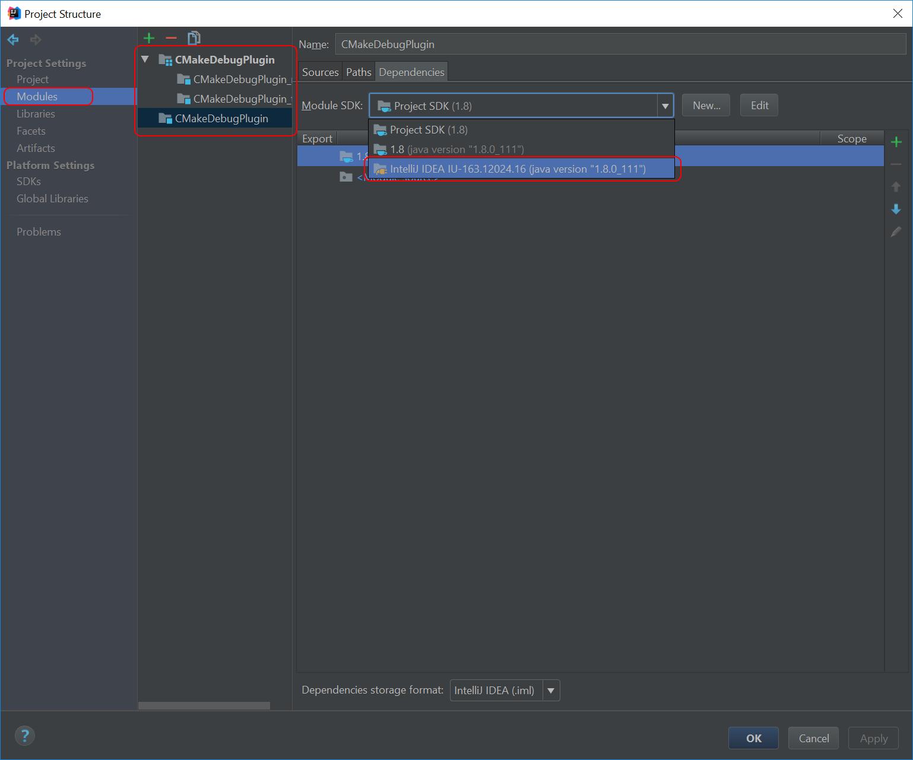

# CMakeDebugPlugin

## Environment Setup

1. Install [jdk](http://www.oracle.com/technetwork/java/javase/downloads/jdk8-downloads-2133151.html), add to path, set $JAVA_HOME env var
1. Download [gradle binaries](https://gradle.org/gradle-download/), add to path
1. Run `gradle build`, observe success
1. Import into IntelliJ IDEA

Select `build.gradle`:

Select these *very important* options:

Create a new `Run Configuration`:

Select `More Items`:

Select `Plugin`:

Name the configuration `ImportantThisIsUnqiueName`:

Open `CMakeDebugPlugin.iws` from your root folder and search for `ImportantThisIsUnqiueName`:

Set the `<module name="" />` to be `<module name="CMakeDebugPlugin" />` close out of the `.iws` editor, and open `Run Configurations` to be sure it took effect:

Open `Module Settings`:

Set the `Project SDK` to be your IntelliJ version:

Hit `debug` and observe a second copy of IntelliJ has launched in debug mode:

